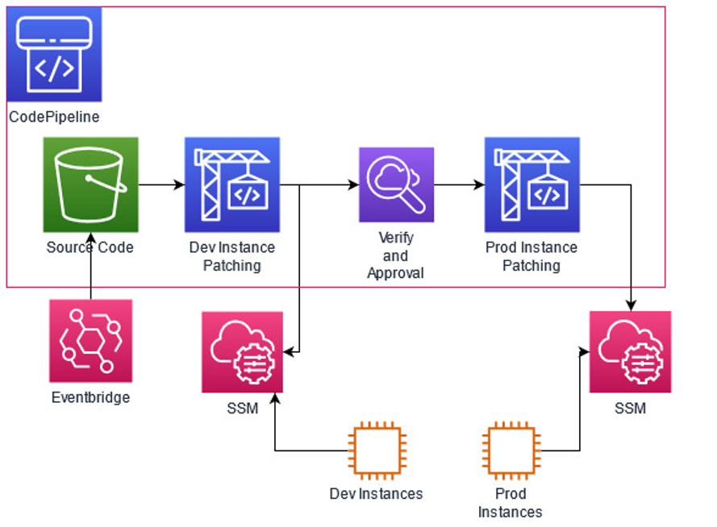

# OS Patching Pipeline

During On-boarding, there are a number of Operations Tasks that need to be completed such as setting up Patching, Backup, Tagging etc, to support the workloads.
This artifact will be focusing in on Patch Management. This would targeted for customers who are going to the server route.
Pipeline would be provided where a set of lower environment instances would be patched first and proceed to patch a set production instances 
This would provide a good starting point for customers to automate OS Patching

## Prereqs

Ensure SSM Agent or SSM Instance Profile is on targeted Instances
Supported Operating Systems are leveraged 
Terraform Installed
Instance Tags (Key:Value)
	application-environment: dev or prod

## Architecture

Terraform used to create resources
Codepipline and Codebuild used for pipeline
Eventbridge to trigger pipeline based on schedule
SSM Commands to patch targeted instances

## Demo

